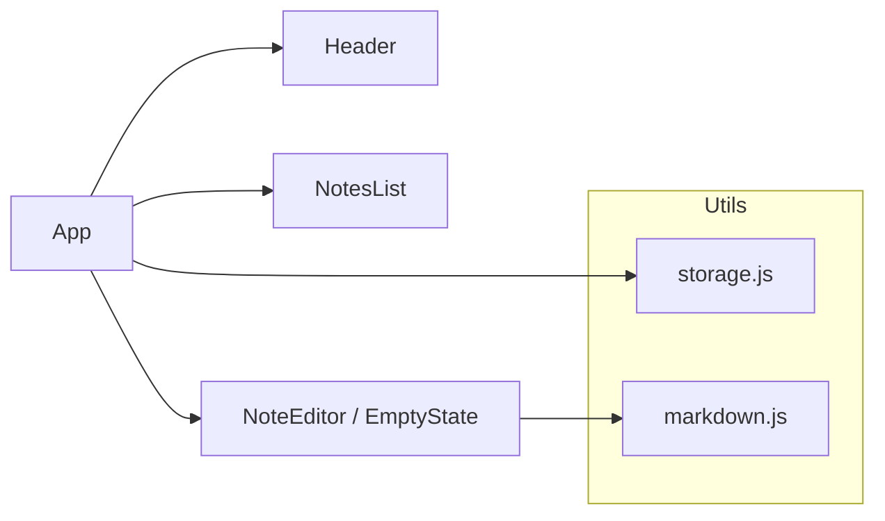

# Simple Notes

## Overview
Ocean Notes is a single-page React application that lets users create, edit, and manage personal notes with a modern UI themed “Ocean Professional.” The application is designed with a local-first approach, persisting data in the browser’s localStorage as a baseline, while being prepared for a future backend integration via environment-configurable endpoints.

The UI uses a two-pane layout: a sidebar for searching and organizing notes, and a main editor for authoring markdown content with a lightweight preview. Accessibility and responsiveness are first-class concerns, and the app is optimized for fast interactions, low dependencies, and easy future expansion.

## Goals and Non-Goals
### Goals
- Provide a responsive, accessible, and performant notes UI with minimal dependencies.
- Support create, update (autosave), delete, search, and sort notes locally.
- Deliver a clean, modern design themed “Ocean Professional.”
- Make the data/storage layer migration-ready to enable future backend/API integration.
- Keep the component architecture simple and maintainable.

### Non-Goals
- Implement server-side persistence or authentication in the baseline.
- Provide multi-user collaboration, sharing, or real-time presence.
- Implement URL routing or deep-linking to specific notes (internal state routing suffices).

## Key User Flows
1. Create a new note
   - User clicks “+ New note” in Header or EmptyState.
   - A new note is created with default title “Untitled” and empty body.
   - The notes list refreshes and the new note becomes selected for editing.

2. Edit a note and autosave
   - User types in the NoteEditor title/body fields.
   - Changes are debounced and persisted to localStorage (status “Editing…” → “Saved”).

3. Search and select a note
   - User types in search input; list filters by title/body.
   - Sorting can be changed by updated/created/title.
   - User selects a note via click or keyboard navigation; the editor displays the note.

4. Delete a note
   - User deletes from the list row button or the editor’s Delete button.
   - The notes list refreshes; selection moves to the next available note or empty state.

5. Toggle preview
   - User toggles between “Edit” and “Preview.”
   - Markdown is rendered via a minimal in-app renderer (no external dependencies).

ASCII flow example:
- Header [+ New] -> createNote() -> listNotes() -> select(noteId) -> NoteEditor
- NotesList [Search/Sort/Select/Delete] -> onSelect/onDelete -> App state -> NoteEditor
- NoteEditor [title/body change] -> onChange -> updateNote() -> listNotes() -> status Saved

## High-Level Architecture
The app is built as a single React SPA with a top-level App component that coordinates state and renders the layout:

- App (src/App.js)
  - Header (src/components/Header.js)
  - Main
    - NotesList (src/components/NotesList.js)
    - NoteEditor or EmptyState (src/components/NoteEditor.js / src/components/EmptyState.js)
- Utilities
  - storage.js (src/utils/storage.js): localStorage CRUD, environment detection, migration-friendly schema
  - markdown.js (src/utils/markdown.js): minimal markdown rendering for preview
- Styles
  - theme.css (src/theme.css): Ocean Professional theme tokens and UI styles
  - index.css (src/index.css): base resets

ASCII diagram:
App
|-- Header
|-- Main
|   |-- NotesList
|   |-- NoteEditor (or EmptyState)
|
|-- Footer/Status (env indicator)
Utilities
|-- storage (CRUD, env)
|-- markdown (preview)
Styles
|-- theme.css
|-- index.css

## Component Architecture
### App (src/App.js)
- Owns the primary UI state:
  - notes: array loaded from storage.listNotes()
  - selectedId: currently selected note id
  - searchQuery: filter string for NotesList
  - sortBy: sorting mode for NotesList
- Wires all container-level handlers:
  - handleNewNote → storage.createNote
  - handleUpdateSelected → storage.updateNote
  - handleDelete → storage.deleteNote
- Performs list refreshes (refreshList) after CRUD to keep UI in sync.
- Memoizes derived values:
  - visibleNotes via storage.searchNotes
  - selectedNote via notes + selectedId
- Displays environment indicator (local storage vs backend-ready mode)

### Header (src/components/Header.js)
- Shows brand, badge, and “+ New note” button.
- Emits onNew callback to App.

### NotesList (src/components/NotesList.js)
- Displays search input, sort dropdown, and the notes list.
- Handles keyboard navigation (ArrowUp/Down, Enter to select, Delete to delete).
- Uses useMemo to sort the incoming notes by selected criterion.
- Notifies App via onSelect, onDelete, and onSearchChange.

### NoteEditor (src/components/NoteEditor.js)
- Edits the selected note’s title/body.
- Debounced autosave via onChange callback to App.
- Toggles between Edit and Preview states.
- Uses minimal markdown renderer to produce safe-ish HTML (escapes, basic formatting).

### EmptyState (src/components/EmptyState.js)
- Friendly call-to-action to create the first note.

## State Management
- Local UI state is held in functional React components using useState and useMemo.
- The top-level App component is the source of truth for notes and selection.
- No external state management library is used in the baseline; complexity is low and confined to a small component tree.
- Derived state:
  - visibleNotes = searchNotes(query, notes)
  - selectedNote derived by id
- Autosave uses a debounced effect in NoteEditor to reduce write frequency.

## Data and Storage Layer
### Baseline: localStorage
- The application uses localStorage as the default persistence layer via src/utils/storage.js.
- Key schema:
  - notes data: LS_KEY = "notes.app.v1"
    - Structure: { notes: Array<Note> }
  - metadata: META_KEY = "notes.app.meta"
    - Structure: { updatedAt: ISO8601, version: 1 }
- Note schema:
  - id: string (e.g., "note_<random><timestamp>")
  - title: string
  - body: string
  - createdAt: ISO string
  - updatedAt: ISO string

CRUD APIs:
- listNotes() → Note[]
- getNote(id) → Note|null
- createNote({ title, body }) → Note
- updateNote(id, partial) → Note|null
- deleteNote(id) → boolean
- searchNotes(query, notes) → Note[]

### Migration-Ready Schema
- Versioned metadata under META_KEY enables future migrations. Current version is 1.
- Future revisions can:
  - Add a migration step that reads previous version, transforms data, and writes new schema.
  - Introduce tagging or folder structures while keeping backward compatibility.

### Environment Detection
- getEnv() returns:
  - apiBase: REACT_APP_API_BASE
  - backendUrl: REACT_APP_BACKEND_URL
  - wsUrl: REACT_APP_WS_URL
  - useBackend: boolean (true if any of the above are set)
- App currently displays status based on useBackend but uses localStorage for all CRUD.
- When integrating a backend, storage.js can be adapted to route calls to fetch-based APIs or a service layer while retaining the same public interface.

## Theming and Style Guide (Ocean Professional)
- Theme tokens are defined in src/theme.css:
  - Colors: primary #2563EB, secondary/success #F59E0B, error #EF4444, bg #f9fafb, surface #ffffff, text #111827
  - Radii: small/medium/large
  - Shadows: sm/md/lg
  - Transitions: fast/standard
  - Border and focus-ring definitions
- Design language:
  - Modern minimalism with subtle shadows and rounded corners.
  - Gradient and soft background transitions for polish.
  - High-contrast text and clear focus states for accessibility.
- Component styles:
  - Buttons: primary, secondary, ghost variants
  - Inputs/Selects: bordered with focus ring
  - Cards and panels: surface background with border and shadow
- Responsiveness:
  - Two-column layout on desktop; collapses to stacked view on smaller screens.

## Accessibility
- Keyboard navigation for NotesList (Arrow Up/Down, Enter, Delete).
- aria attributes:
  - role="banner" (Header), role="main" (Main), role="listbox"/"option" (NotesList), aria-live for save status
- Focus styles: visible focus rings on interactive elements.
- Contrast-aware palette with readable text on surface backgrounds.
- Inputs and interactive controls include appropriate aria-labels.
- Semantic markup: headings, sections, and labels applied consistently.

## Responsiveness
- CSS Grid-based layout adjusts via media queries:
  - Desktop: grid-template-columns: 320px 1fr
  - Tablet: 280px 1fr
  - Mobile: stacked layout with list above editor
- Scroll management:
  - Sidebar list scrolls independently with “nearest” scroll into view on keyboard navigation.
- Touch-friendly controls with sufficiently large tap targets and spacing.

## Environment Variables and Configuration
The app reads the following environment variables (via process.env) at build time:
- REACT_APP_API_BASE
- REACT_APP_BACKEND_URL
- REACT_APP_WS_URL
- REACT_APP_FRONTEND_URL
- REACT_APP_NODE_ENV
- REACT_APP_NEXT_TELEMETRY_DISABLED
- REACT_APP_ENABLE_SOURCE_MAPS
- REACT_APP_PORT
- REACT_APP_TRUST_PROXY
- REACT_APP_LOG_LEVEL
- REACT_APP_HEALTHCHECK_PATH
- REACT_APP_FEATURE_FLAGS
- REACT_APP_EXPERIMENTS_ENABLED

Baseline usage:
- storage.getEnv() consolidates REACT_APP_API_BASE, REACT_APP_BACKEND_URL, and REACT_APP_WS_URL to compute useBackend.
- The App displays a footer status indicating local storage vs backend readiness.

Configuration guidance:
- Do not commit secrets. Provide a .env via deployment tooling only.
- Example .env:
  REACT_APP_API_BASE=
  REACT_APP_BACKEND_URL=
  REACT_APP_WS_URL=

## Error Handling and Logging
- Storage operations are synchronous and small; parsing errors are guarded via safeParse with fallbacks.
- Autosave is debounced to avoid rapid write cycles and potential thrash.
- For UI:
  - Controlled inputs prevent uncontrolled-to-controlled warnings.
  - Defensive checks when selection changes or items are deleted.
- Logging:
  - Use console.debug/info/warn/error as needed during development.
  - Future: gate logs with REACT_APP_LOG_LEVEL, and centralize a logger utility to standardize output and redaction if backend is added.

## Performance Considerations
- Minimal dependencies: only React and react-scripts to keep bundle size low.
- Local computed derivations via useMemo to avoid repeated expensive operations (sorting, filtering).
- Debounced autosave to reduce write frequency and re-renders.
- Virtualization is unnecessary at the current expected note count; can be considered if thousands of notes become common.
- Source maps can be disabled with REACT_APP_ENABLE_SOURCE_MAPS=false for production build optimization.

## Security and Privacy (Local Storage)
- All data is stored in localStorage on the client device.
- There is no data encryption at rest in the baseline; sensitive data should not be stored unless a backend with proper security is added.
- Cross-Site Scripting (XSS):
  - The markdown renderer escapes HTML and only allows very basic inline transformations to reduce risk.
  - Avoid rendering untrusted HTML; keep the renderer conservative.
- Future: when adding backend:
  - Use HTTPS, CSRF protections, and secure cookies/JWT best practices.
  - Consider encryption at rest and role-based access if multi-user accounts are added.

## Build and Deploy
- Scripts (package.json):
  - npm start: development server
  - npm test: unit tests (react-scripts)
  - npm run build: production build
- CI/CD:
  - Build with environment variables provided at build time.
  - Serve the build output (build/) via a static hosting service or CDN.
- Health checks:
  - Optional: expose REACT_APP_HEALTHCHECK_PATH to integrate a simple status endpoint when a future backend is added.

## Roadmap for Backend Integration
The storage layer is designed to switch from localStorage to a networked API with minimal UI changes.

Phased approach:
1. Introduce a StorageService interface
   - Keep the existing functions: listNotes, getNote, createNote, updateNote, deleteNote, searchNotes, getEnv.
   - Provide two implementations:
     - LocalStorageStorage (current)
     - ApiStorage (future), implemented with fetch or a small HTTP client.
   - Add runtime selection in storage.js based on getEnv().useBackend.

2. API design (suggested)
   - Endpoints:
     - GET /notes
     - GET /notes/:id
     - POST /notes
     - PATCH /notes/:id
     - DELETE /notes/:id
   - Payload schema mirrors current Note fields; consider server-generated ids and timestamps.

3. Authentication (optional, future)
   - Token-based (e.g., OAuth/OIDC) or session cookies with CSRF protection.
   - Handle token refresh and error states gracefully in the ApiStorage.

4. Real-time updates (optional)
   - Use REACT_APP_WS_URL to subscribe to note changes if collaboration or multi-device sync is introduced.
   - Reconcile conflicts with last-write-wins or CRDT if collaboration is advanced.

5. Containers (potential)
   - Frontend container (this app): static assets served by a CDN or a lightweight Node/NGINX container.
   - Backend container: REST API service handling CRUD, auth, and persistence.
   - Optional database container (e.g., Postgres) and reverse proxy (NGINX/Caddy/Traefik).

6. Migration strategy
   - On first successful backend fetch, optionally migrate local notes:
     - Upload local notes that are not present on the server.
     - Tag migrated notes to avoid duplication.
     - Provide a user-controlled step or automatic migration with confirmation.

Mermaid-style future container diagram (for planning; not implemented today):
- [Frontend Container] --HTTP--> [Backend API Container] --DB--> [Database]
- [Frontend Container] --WS--> [Backend API Container WebSocket]

Text/ASCII equivalent:
[Browser SPA] --HTTP--> [API Service] --SQL--> [DB]
[Browser SPA] --WS?--> [API Service]

## Testing Strategy
- Unit tests:
  - Component rendering and basic interactions (e.g., header title).
  - Utilities: markdown rendering correctness and storage behaviors (mock localStorage).
- Integration tests (future):
  - Simulate create/edit/delete flows.
  - With ApiStorage, mock fetch to verify network behaviors.

## Maintenance and Extensibility
- Keep storage.js as the single integration point for persistence.
- Maintain clear public interfaces in utilities; avoid leaking implementation details to components.
- Centralize theme tokens in theme.css to enable easy restyling or theming switches.
- Keep components focused with single responsibilities and small props surfaces.

## Appendix: File Map
- src/App.js: App shell, state coordination
- src/components/Header.js: header and actions
- src/components/NotesList.js: sidebar with search/sort and navigation
- src/components/NoteEditor.js: editor with autosave and preview
- src/components/EmptyState.js: initial call-to-action UI
- src/utils/storage.js: localStorage CRUD and env detection
- src/utils/markdown.js: minimal markdown renderer
- src/theme.css: Ocean Professional theme and UI styles
- src/index.css: base resets
- src/index.js: React root

Sources of truth:
- The above architecture reflects the current implementation in the repository and is intended to be kept in sync as features evolve.
